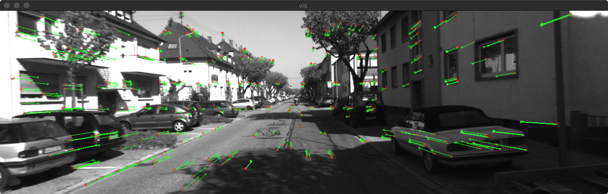
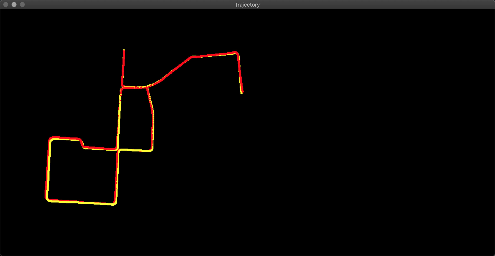

## Stereo Visual Odometry


C++ implementation of Stereo Visual Odometry, using optical flow for feature tracking.






### Requirements
[OpenCV 3.0](https://opencv.org/)  
If you are not using CUDA:  
```bash
sudo apt update
sudo apt install libopencv-dev 
```
If you use CUDA, compile and install CUDA enabled OPENCV. 

### Dataset
Tested on [KITTI](http://www.cvlibs.net/datasets/kitti/eval_odometry.php) odometry dataset.

### Compile & Run
```bash
git clone https://github.com/ZhenghaoFei/visual_odom.git
```
The system use **Camera Parameters** in calibration/xx.yaml, put your own camera parameters in the same format and pass the path when you run.

```bash
mkdir build
cd build
cmake ..
make -j4
./run /PathToKITTI/sequences/00/ ../calibration/kitti00.yaml
```

### GPU CUDA acceleration
Time consumtion function `circularMatching()` can be accelerated using CUDA and greately improve the performance. 60~80 FPS on a decent NVIDIA Card. 
To enable GPU acceleration
1. Make sure you have CUDA compatible GPU.
2. Install CUDA, compile and install CUDA supported OpenCV 
3. When compiling, use 
```bash
cmake .. -DUSE_CUDA=on
```
4. Compile & Run
